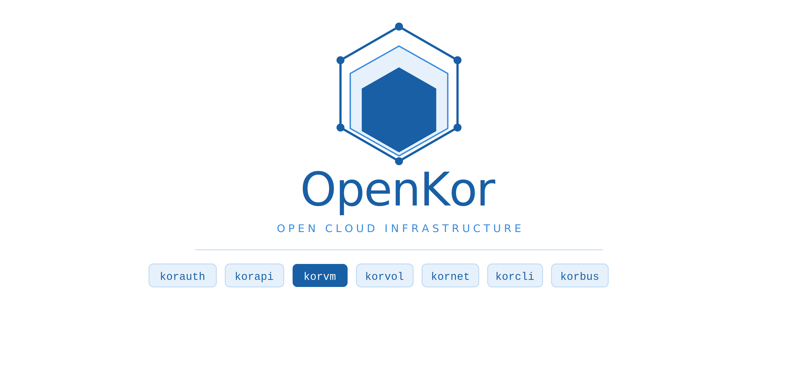

<p align="center">
  
</p>

<p align="center">
  <a href="https://golang.org"></a>
  <a href="https://github.com/OpenKorProject/openkor/blob/main/LICENSE"></a>
  
  <a href="https://github.com/OpenKorProject/openkor/blob/main/CONTRIBUTING.md"></a>
</p>

---

OpenKor is an open source cloud infrastructure platform built to provide **KVM-based virtual machine management**, distributed storage, and virtual networking under a single, vendor-lock-free roof.

Written entirely in **Go**, built on **libvirt/KVM**, and designed so that every service can be deployed independently — OpenKor is a ground-up implementation of a modern, multi-service cloud platform.

---

## Table of Contents

- [Architecture](#architecture)
- [Services](#services)
- [Quick Start](#quick-start)
- [API](#api)
- [Repository Structure](#repository-structure)
- [Roadmap](#roadmap)
- [Design Decisions](#design-decisions)
- [Contributing](#contributing)
- [License](#license)

---

## Architecture

OpenKor is **not monolithic**. Each service runs as its own process, manages its own database schema, and can be scaled and deployed independently.

```
                        ┌─────────────┐
                        │   korcli    │  ← CLI tool
                        └──────┬──────┘
                               │
                        ┌──────▼──────┐
                        │   korapi    │  ← API Gateway (all traffic flows through here)
                        └──────┬──────┘
                               │
          ┌────────────────────┼────────────────────┐
          │                    │                    │
   ┌──────▼──────┐      ┌──────▼──────┐      ┌──────▼──────┐
   │   korauth   │      │    korvm    │      │   korvol    │
   │  (Auth/IAM) │      │  (KVM/VMs)  │      │  (Storage)  │
   └─────────────┘      └─────────────┘      └─────────────┘
          │                    │                    │
   ┌──────▼─────────────────────────────────────────▼──────┐
   │                       PostgreSQL                        │
   └────────────────────────────────────────────────────────┘
```

**Inter-service communication:** REST in MVP — gRPC + NATS event bus in v2.

---

## Services

| Service | Responsibility | Stack |
|---------|---------------|-------|
| **korauth** | Authentication, users, roles, and tenant management | Go · Gin · PostgreSQL · JWT · Redis |
| **korapi** | API Gateway — rate limiting, audit log, reverse proxy | Go · Gin |
| **korvm** | KVM virtual machine lifecycle (create/start/stop/migrate/snapshot) | Go · libvirt-go · QEMU/KVM |
| **korvol** | Block storage — volumes, images, backups, attach/detach | Go · LVM (→ Ceph) |
| **kornet** | Virtual networks, subnets, floating IPs, security groups *(v2)* | Go · VXLAN |
| **kormon** | Metrics, alerting, logging, dashboard *(v2)* | Go · Prometheus |
| **korbus** | Inter-service event bus *(v2)* | Go · NATS |
| **korcli** | CLI access to all services | Go · Cobra |

---

## Quick Start

### Prerequisites

- Go 1.22+
- Docker & Docker Compose
- A Linux host with KVM/QEMU and `libvirt` installed
- PostgreSQL 15+

### Setup

```bash
# Clone the repository
git clone https://github.com/OpenKorProject/openkor-installer
cd openkor

# Configure environment variables
cp .env.example .env

# Start the development environment
docker-compose up -d
```

> **Note:** `korvm` and `korvol` run in `privileged` mode to access KVM and LVM. Make sure KVM virtualization is enabled on your host machine.

### Get Your First Token

```bash
curl -X POST https://test-api.openkor.cloud/v1/auth/login \
  -H "Content-Type: application/json" \
  -d '{"username": "admin", "password": "changeme"}'
```

### Create Your First VM

```bash
kor vm create --name my-vm --cpu 2 --memory 2048 --disk 20G --image ubuntu-22.04
```

---

## API

All requests route through the `korapi` gateway. Individual services are never exposed directly.

```
Base URL:   https://test-api.openkor.cloud/v1/{service}
Auth:       Bearer <JWT Token>
Format:     JSON
Versioning: URL-based — /v1/, /v2/
```

| Endpoint | Description |
|----------|-------------|
| `POST /v1/auth/login` | Authenticate and receive a JWT |
| `GET  /v1/vm/` | List all virtual machines |
| `POST /v1/vm/` | Create a new virtual machine |
| `POST /v1/vm/{id}/start` | Start a virtual machine |
| `POST /v1/vm/{id}/stop` | Stop a virtual machine |
| `GET  /v1/vol/` | List all volumes |
| `POST /v1/vol/` | Create a new volume |
| `POST /v1/vol/{id}/attach` | Attach a volume to a VM |

Full API documentation: #TODO

---

## Roadmap

### MVP (v0.1)

- [x] Project architecture and technical decisions

### v2 Goals

- [ ] `kornet` — VXLAN, floating IPs, security groups
- [ ] `kormon` — Prometheus integration, alerting system
- [ ] `korbus` — NATS-based event bus
- [ ] gRPC for inter-service communication
- [ ] Ceph integration (migration from LVM)
- [ ] Web UI (`korui`)

---

## Design Decisions

**Why Go?** Low memory footprint, strong concurrency primitives, and the maturity of the `libvirt-go` library.

**Why a single PostgreSQL instance?** Simplicity is the priority for MVP. Each service uses its own schema within the same instance; migration to per-service instances is planned for later versions.

**Why not monolithic?** So that each service can be deployed, scaled, and updated independently — without vendor lock-in and without the platform becoming a single point of failure.

---

## Contributing

Contributions are welcome! Please read [`CONTRIBUTING.md`](https://github.com/OpenKorProject/openkor/blob/main/CONTRIBUTING.md) before getting started.

```bash
# Fork and create a branch
git checkout -b feature/your-feature-name

# Commit your changes
git commit -m "feat: add your feature"

# Open a pull request
git push origin feature/your-feature-name
```

For bugs or feature requests, please [open an issue](https://github.com/OpenKorProject/openkor/issues).

---

## License

[Apache 2.0](https://github.com/OpenKorProject/openkor/blob/main/LICENSE) — © 2026 OpenKor Contributors
